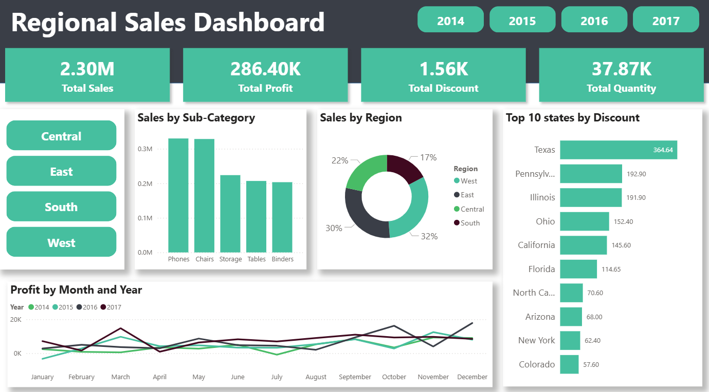

<!-- PROJECT HEADER -->
<h1 align="center">📊 REGIONAL SALES DASHBOARD</h1>
<p align="center">
  <code>Power BI</code> <code>Excel</code> <code>Data Analysis</code> <code>Dashboard</code>
</p>

<p align="center">
  <i>Insights Into Regional Revenue, Profitability & Sales Distribution</i>
</p>

<p align="center">
  <!-- Badges -->
  
  
  
  
</p>

---

## 🚀 Overview

This project features an interactive **Regional Sales Performance Dashboard** built entirely in **Power BI**, with Excel used for initial data review.  
The dashboard provides deep insights into:

- 🌍 Regional performance  
- 💰 Sales & profit distribution  
- 📦 Product sub-category performance  
- 🔻 Discount behavior across states  
- 📈 Trend analysis over multiple years  

It is designed to support **business decision-making**, **regional strategy**, and **profit optimization**.

---

## 🖼 Dashboard Preview

<div align="center">
  
</div>

---

## 🎯 Dashboard Objectives

This dashboard was designed to achieve the following analytical goals:

- Track overall business performance across **Sales**, **Profit**, **Discount**, and **Quantity**.  
- Compare **regional performance** to identify high- and low-performing areas.  
- Analyze **product sub-category sales** to understand demand distribution.  
- Monitor **discount concentration** across states to detect profitability risks.  
- Visualize **profit trends over time** to identify seasonality and growth patterns.

---

## 📌 Key Insights

### 🔹 **1. Sales & Profit Overview**
- **Total Sales:** $2.30M  
- **Total Profit:** $286.40K  
- Profit margin sits around **~12.5%**, which may fall below ideal benchmarks.  
- **2017** shows a major increase in sales and profit — but also a sharp rise in discounts.  
- **2015–2016** show flat trends before the 2017 surge.

---

### 🔹 **2. Regional Performance**
- **West & East regions lead** with **62% combined sales**.  
- **South region lags behind** at 17%.  
- **Central region** performs moderately but shows **high discount concentration**, affecting profitability.

---

### 🔹 **3. Sub-Category Sales**
Top-performing categories:
- 📱 **Phones**  
- 💺 **Chairs**  
- 🖨️ **Copiers**

Low-performing categories:
- 📘 **Binders**  
- 🪑 **Tables**  

Possible causes include market saturation or pricing challenges.

---

### 🔹 **4. Discount Distribution**
- **Texas** and **Pennsylvania** receive the highest discounts — impacting margins.  
- **Colorado** and **Arizona** show healthier discount levels and may be useful models for **discount control**.

---

### 🔹 **5. Profit Trend Analysis**
- Profit shows **seasonal fluctuations**, peaking in **March** and dipping in **July** and then rise in **December**  
- **2017** demonstrates the strongest growth trend.  
- Earlier years show more volatility and slower growth.

---

## 🧭 Recommendations

### ⭐ Improve Profit Margin
- Reevaluate discount strategies in **high-discount states** (Texas, Pennsylvania).  
- Consider **tiered discounting** based on volume or customer value.

### ⭐ Regional Strategy
- Increase marketing focus in the **South region**.  
- Tailor product offerings to match regional demand patterns.

### ⭐ Product Portfolio Optimization
- Promote strong performers: **Copiers, Phones, Chairs**.  
- Reassess underperformers (Binders, Tables) — explore **bundling** or **discontinuation**.

### ⭐ Forecasting & Planning
- Use historical monthly trends to forecast demand.  
- Align staffing, inventory, and supply chain with **peak months (e.g., March)**.

---

## 🛠 Tech Stack

| Tool | Purpose |
|------|---------|
| **Excel** | Initial data check & formatting |
| **Power BI** | Dashboard creation |
| **GitHub** | Documentation & version control |

---

## 📂 Project Structure
```
📦 Regional-Sales-Dashboard
│
├── 📊 Regional_Sales_Dashboard.pbix
├── 📊 Regional_Sales.xlsx
├── 🖼 Assets
│ └── Dashboard_preview.jpg
└── README.md
```

---

## ▶️ How to Use

1. Download the **.pbix** file  
2. Open in **Power BI Desktop**  
3. Explore filters (Region, State, Product Category)  
4. Interact with visuals for deeper insights  

---

## 🌟 What You Learn from This Project

- Regional sales analysis  
- State-level discount correlation  
- Product-level performance evaluation  
- Trend & seasonality interpretation  
- Building a clean, business-ready dashboard in **Power BI**

---

## 🤝 Contributions

Have something to improve or add?  
Fork the repo, open an issue, or submit a pull request.

---

## 📧 Contact

For collaborations, dashboards, or automation projects:  
📩 **Email:** [Email Me](mailto:musedikutemitope@gmail.com)  
💬 **WhatsApp:** [Chat on WhatsApp](https://wa.me/2348072240480)  
💼 **LinkedIn:** [Connect with me](https://www.linkedin.com/in/joshua-musediku-510945302)

---

## ⭐ Found this useful? Please give this project a star!

---

## 🏷️ Tags  
`sales-analytics` `power-bi` `excel` `regional-performance` `data-analysis` `dashboard` `business-intelligence`

---
